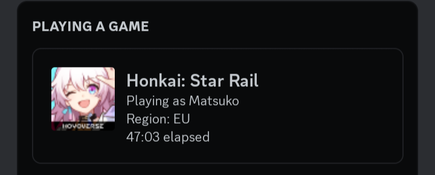
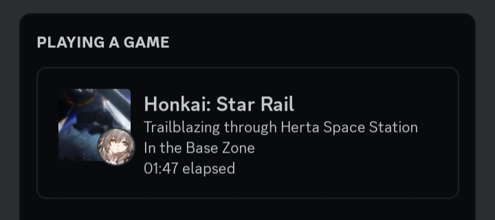
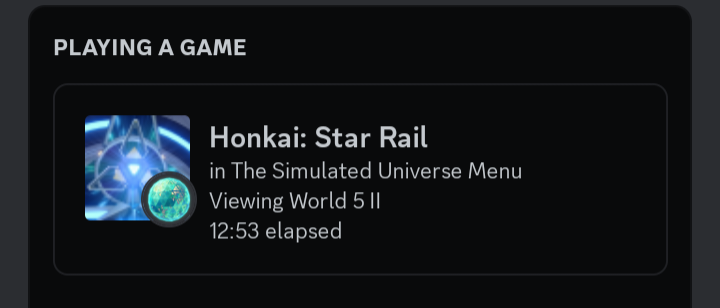
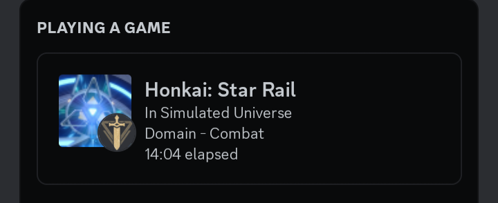
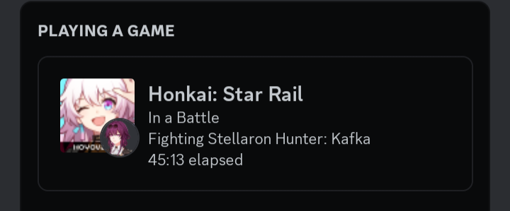

# Elysia-Rich-Presence - will be Updated whenever new Worlds/Bosses gets added

It's a simple Honkai: Star Rail RPC using OCR (it only works with EN lang text currently however you can edit the configs.json and add language if you want to.)

Rich Presence examples (you gonna change the fallback.json for your username/region):

- All the image assets belongs to miHoYo, as they are taken/extracted from the game.
- You can talk with me at Matsuko#3600 for anything regarding the rich presence.
- No, it's not perfect keep in mind you have to stay on the game window for it to capture the text content all the time otherwise when you switch windows it's gonna revert to the normal presence with just your username.
- Not gonna always detect everything.

# Tutorial

You will have to download first off Tesseract for it to scan for text.
- [Download Tesseract](https://digi.bib.uni-mannheim.de/tesseract/?C=M;O=A) == [5.0.1](https://digi.bib.uni-mannheim.de/tesseract/tesseract-ocr-w64-setup-v5.0.1.20220118.exe)

# Other information
Main idea was from [Zanzancomms's Genshin-Impact-Rich-Presence](https://github.com/Zanzancomms/Genshin-Impact-Rich-Presence) script, check their amazing work!
